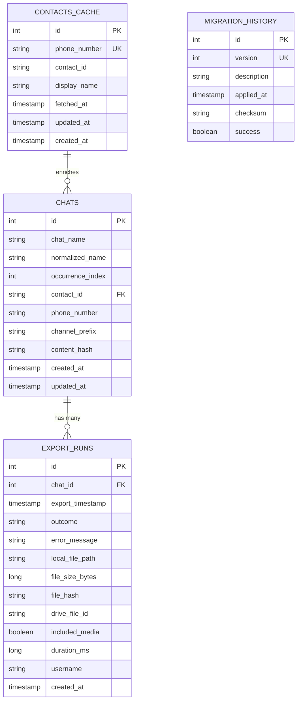

# Database Schema Documentation

**WhatsLiberation Persistent Registry - Phase C**

## Entity-Relationship Diagram

### High-Level ERD (Mermaid)



### Detailed ERD with Relationships

```
┌─────────────────────────────────────────────────────────────┐
│                          CHATS                               │
├─────────────────────────────────────────────────────────────┤
│ PK  id                    INTEGER                            │
│     chat_name             VARCHAR(255)      [indexed]        │
│     normalized_name       VARCHAR(255)      [indexed]        │
│     occurrence_index      INTEGER           [default: 0]     │
│     contact_id            VARCHAR(100)      [nullable]       │
│     phone_number          VARCHAR(50)       [nullable]       │
│     channel_prefix        VARCHAR(10)       [nullable]       │
│     content_hash          VARCHAR(64)       [nullable]       │
│     created_at            TIMESTAMP                          │
│     updated_at            TIMESTAMP                          │
├─────────────────────────────────────────────────────────────┤
│ UNIQUE INDEX: (chat_name, occurrence_index, channel_prefix) │
└─────────────────────────────────────────────────────────────┘
                               │
                               │ 1:N
                               ▼
┌─────────────────────────────────────────────────────────────┐
│                       EXPORT_RUNS                            │
├─────────────────────────────────────────────────────────────┤
│ PK  id                    INTEGER                            │
│ FK  chat_id               INTEGER           [→ CHATS.id]     │
│     export_timestamp      TIMESTAMP         [indexed]        │
│     outcome               VARCHAR(20)       [SUCCESS|...]    │
│     error_message         TEXT              [nullable]       │
│     local_file_path       VARCHAR(500)      [nullable]       │
│     file_size_bytes       BIGINT            [nullable]       │
│     file_hash             VARCHAR(64)       [nullable,idx]   │
│     drive_file_id         VARCHAR(100)      [nullable]       │
│     included_media        BOOLEAN           [default: false] │
│     duration_ms           BIGINT            [nullable]       │
│     username              VARCHAR(100)      [nullable]       │
│     created_at            TIMESTAMP                          │
├─────────────────────────────────────────────────────────────┤
│ INDEX: (chat_id)                                             │
│ INDEX: (export_timestamp)                                    │
│ INDEX: (file_hash)                                           │
└─────────────────────────────────────────────────────────────┘

┌─────────────────────────────────────────────────────────────┐
│                     CONTACTS_CACHE                           │
├─────────────────────────────────────────────────────────────┤
│ PK  id                    INTEGER                            │
│ UK  phone_number          VARCHAR(50)       [unique indexed] │
│     contact_id            VARCHAR(100)                       │
│     display_name          VARCHAR(255)                       │
│     fetched_at            TIMESTAMP                          │
│     updated_at            TIMESTAMP                          │
│     created_at            TIMESTAMP                          │
├─────────────────────────────────────────────────────────────┤
│ UNIQUE INDEX: (phone_number)                                 │
└─────────────────────────────────────────────────────────────┘
                               │
                               │ N:1 (soft reference)
                               │ via phone_number
                               ▼
                           CHATS.phone_number

┌─────────────────────────────────────────────────────────────┐
│                    MIGRATION_HISTORY                         │
├─────────────────────────────────────────────────────────────┤
│ PK  id                    INTEGER                            │
│ UK  version               INTEGER           [unique indexed] │
│     description           TEXT                               │
│     applied_at            TIMESTAMP                          │
│     checksum              VARCHAR(64)                        │
│     success               BOOLEAN           [default: true]  │
├─────────────────────────────────────────────────────────────┤
│ UNIQUE INDEX: (version)                                      │
└─────────────────────────────────────────────────────────────┘
```

## Table Definitions

### 1. CHATS Table

**Purpose**: Stores chat metadata for tracking exports over time.

#### Columns

| Column | Type | Constraints | Description |
|--------|------|-------------|-------------|
| `id` | INTEGER | PRIMARY KEY, AUTO INCREMENT | Unique chat identifier |
| `chat_name` | VARCHAR(255) | NOT NULL, INDEXED | Display name as it appears in WhatsApp UI |
| `normalized_name` | VARCHAR(255) | NOT NULL, INDEXED | Lowercase normalized name for fuzzy matching |
| `occurrence_index` | INTEGER | NOT NULL, DEFAULT 0 | Index for duplicate names (0-based). E.g., three "John" chats have indices 0, 1, 2 |
| `contact_id` | VARCHAR(100) | NULLABLE | Google Contacts ID (may not be available for groups) |
| `phone_number` | VARCHAR(50) | NULLABLE | Phone number (not available for groups) |
| `channel_prefix` | VARCHAR(10) | NULLABLE | Channel identifier (e.g., "HK" for WhatsApp Business, NULL for personal) |
| `content_hash` | VARCHAR(64) | NULLABLE | SHA-256 hash of chat content for deduplication |
| `created_at` | TIMESTAMP | NOT NULL, DEFAULT CURRENT_TIMESTAMP | When this chat was first discovered |
| `updated_at` | TIMESTAMP | NOT NULL, DEFAULT CURRENT_TIMESTAMP | Last update timestamp |

#### Indexes

1. **idx_chat_name** - B-tree index on `chat_name` for fast lookup
2. **idx_normalized_name** - B-tree index on `normalized_name` for fuzzy matching
3. **idx_chat_name_occurrence** - UNIQUE composite index on `(chat_name, occurrence_index, channel_prefix)` to prevent duplicates

#### Constraints

- **Primary Key**: `id`
- **Unique Constraint**: `(chat_name, occurrence_index, channel_prefix)` - Ensures no duplicate chat entries

#### Relationships

- **1:N** with `EXPORT_RUNS` - One chat can have many export runs
- **Soft Reference** to `CONTACTS_CACHE` via `phone_number` (no foreign key constraint)

---

### 2. EXPORT_RUNS Table

**Purpose**: Tracks individual export attempts for each chat (success, failure, skipped).

#### Columns

| Column | Type | Constraints | Description |
|--------|------|-------------|-------------|
| `id` | INTEGER | PRIMARY KEY, AUTO INCREMENT | Unique export run identifier |
| `chat_id` | INTEGER | NOT NULL, FOREIGN KEY → CHATS.id, INDEXED | Reference to the chat being exported |
| `export_timestamp` | TIMESTAMP | NOT NULL, INDEXED, DEFAULT CURRENT_TIMESTAMP | When the export was initiated |
| `outcome` | VARCHAR(20) | NOT NULL | Export result: `SUCCESS`, `FAILED`, or `SKIPPED` |
| `error_message` | TEXT | NULLABLE | Error details if `outcome = FAILED` |
| `local_file_path` | VARCHAR(500) | NULLABLE | Local file path where export was saved |
| `file_size_bytes` | BIGINT | NULLABLE | Size of exported file in bytes |
| `file_hash` | VARCHAR(64) | NULLABLE, INDEXED | SHA-256 hash for file integrity and deduplication |
| `drive_file_id` | VARCHAR(100) | NULLABLE | Google Drive file ID if uploaded to Drive |
| `included_media` | BOOLEAN | NOT NULL, DEFAULT FALSE | Whether media was included in this export |
| `duration_ms` | BIGINT | NULLABLE | Export duration in milliseconds (from start to completion/failure) |
| `username` | VARCHAR(100) | NULLABLE | User who initiated the export (from system property) |
| `created_at` | TIMESTAMP | NOT NULL, DEFAULT CURRENT_TIMESTAMP | Record creation timestamp |

#### Indexes

1. **idx_export_chat_id** - B-tree index on `chat_id` for filtering by chat
2. **idx_export_timestamp** - B-tree index on `export_timestamp` for time-based queries
3. **idx_export_file_hash** - B-tree index on `file_hash` for deduplication detection

#### Constraints

- **Primary Key**: `id`
- **Foreign Key**: `chat_id` references `CHATS.id`
  - On Delete: No cascade (preserve history even if chat deleted)
  - On Update: CASCADE (update chat_id if parent changes)

#### Relationships

- **N:1** with `CHATS` - Many export runs belong to one chat

---

### 3. CONTACTS_CACHE Table

**Purpose**: Caches Google Contacts API lookups to minimize API calls and enable offline operations.

#### Columns

| Column | Type | Constraints | Description |
|--------|------|-------------|-------------|
| `id` | INTEGER | PRIMARY KEY, AUTO INCREMENT | Unique cache entry identifier |
| `phone_number` | VARCHAR(50) | NOT NULL, UNIQUE INDEXED | Phone number (primary lookup key) |
| `contact_id` | VARCHAR(100) | NOT NULL | Google Contacts ID (resource name) |
| `display_name` | VARCHAR(255) | NOT NULL | Display name from Google Contacts |
| `fetched_at` | TIMESTAMP | NOT NULL, DEFAULT CURRENT_TIMESTAMP | When contact was fetched from API |
| `updated_at` | TIMESTAMP | NOT NULL, DEFAULT CURRENT_TIMESTAMP | Last cache update timestamp |
| `created_at` | TIMESTAMP | NOT NULL, DEFAULT CURRENT_TIMESTAMP | Cache entry creation timestamp |

#### Indexes

1. **idx_contacts_phone** - UNIQUE B-tree index on `phone_number` for fast lookup and uniqueness

#### Constraints

- **Primary Key**: `id`
- **Unique Constraint**: `phone_number` - One cache entry per phone number

#### Relationships

- **Soft Reference** from `CHATS` via `phone_number` (no formal foreign key)

---

### 4. MIGRATION_HISTORY Table

**Purpose**: Tracks database schema migrations for version control and rollback support.

#### Columns

| Column | Type | Constraints | Description |
|--------|------|-------------|-------------|
| `id` | INTEGER | PRIMARY KEY, AUTO INCREMENT | Unique migration record identifier |
| `version` | INTEGER | NOT NULL, UNIQUE INDEXED | Migration version number (sequential) |
| `description` | TEXT | NOT NULL | Human-readable description of migration |
| `applied_at` | TIMESTAMP | NOT NULL, DEFAULT CURRENT_TIMESTAMP | When migration was applied |
| `checksum` | VARCHAR(64) | NOT NULL | SHA-256 checksum of migration script for integrity verification |
| `success` | BOOLEAN | NOT NULL, DEFAULT TRUE | Migration success status |

#### Indexes

1. **idx_migration_version** - UNIQUE B-tree index on `version` for fast lookup and version uniqueness

#### Constraints

- **Primary Key**: `id`
- **Unique Constraint**: `version` - One migration per version number

#### Relationships

- None (standalone audit table)

---

## Data Flow Diagram

### Export Lifecycle

```
┌──────────────────────────────────────────────────────────────┐
│                     Export Lifecycle                          │
└──────────────────────────────────────────────────────────────┘

1. DISCOVER CHAT
   ├─ Query: Is chat in database?
   │  └─ SELECT * FROM chats
   │     WHERE chat_name = ? AND occurrence_index = ?
   │
   ├─ If NOT EXISTS:
   │  └─ INSERT INTO chats (chat_name, normalized_name, ...)
   │
   └─ Return: ChatEntity

2. CHECK INCREMENTAL BACKUP
   ├─ Query: Last successful export timestamp
   │  └─ SELECT MAX(export_timestamp) FROM export_runs
   │     WHERE chat_id = ? AND outcome = 'SUCCESS'
   │
   ├─ If recent (< 24 hours):
   │  ├─ INSERT INTO export_runs (chat_id, outcome, error_message)
   │  │  VALUES (?, 'SKIPPED', 'Already exported recently')
   │  └─ SKIP export
   │
   └─ Else: Proceed with export

3. PERFORM EXPORT
   └─ (ADB automation, Drive download, etc.)

4A. EXPORT SUCCESS
    ├─ Calculate: file hash (SHA-256)
    ├─ INSERT INTO export_runs
    │  (chat_id, outcome, local_file_path, file_size_bytes,
    │   file_hash, drive_file_id, included_media, duration_ms)
    │  VALUES (?, 'SUCCESS', ?, ?, ?, ?, ?, ?)
    │
    └─ Optional: UPDATE chats SET content_hash = ? WHERE id = ?

4B. EXPORT FAILURE
    └─ INSERT INTO export_runs
       (chat_id, outcome, error_message, duration_ms)
       VALUES (?, 'FAILED', ?, ?)

5. ENRICH WITH CONTACTS (Optional)
   ├─ Query: Is contact cached?
   │  └─ SELECT * FROM contacts_cache WHERE phone_number = ?
   │
   ├─ If NOT cached OR stale:
   │  ├─ Call Google Contacts API
   │  ├─ UPSERT contacts_cache (phone_number, contact_id, display_name)
   │  └─ UPDATE chats SET contact_id = ?, phone_number = ? WHERE id = ?
   │
   └─ Else: Use cached contact
```

---

## Normalization Analysis

### Normal Forms Compliance

**1NF (First Normal Form)** ✅
- All columns contain atomic values
- No repeating groups
- Each row is uniquely identifiable via primary key

**2NF (Second Normal Form)** ✅
- Meets 1NF
- All non-key columns fully depend on the entire primary key
- No partial dependencies (all tables use single-column primary keys)

**3NF (Third Normal Form)** ✅
- Meets 2NF
- No transitive dependencies
- All non-key columns depend only on the primary key
- Example: `normalized_name` is derived from `chat_name` but stored for performance (denormalization by design)

**BCNF (Boyce-Codd Normal Form)** ✅
- Meets 3NF
- Every determinant is a candidate key
- No anomalies detected

### Denormalization Decisions

1. **`normalized_name` in CHATS**
   - **Why**: Avoid repeated `LOWER(TRIM(chat_name))` in queries
   - **Trade-off**: 255 bytes extra storage per row vs. significant query performance improvement
   - **Justification**: Fuzzy matching is a core use case, worth the storage cost

2. **Soft Reference to CONTACTS_CACHE**
   - **Why**: Avoid rigid coupling; cache can be cleared independently
   - **Trade-off**: No referential integrity enforcement vs. flexibility
   - **Justification**: Contact cache is auxiliary data, not critical to core export functionality

---

## Storage Considerations

### Estimated Storage Requirements

**Chats Table**
- Average row size: ~450 bytes (with typical chat names and hashes)
- 1,000 chats = 450 KB
- 10,000 chats = 4.5 MB
- 100,000 chats = 45 MB

**Export Runs Table**
- Average row size: ~650 bytes (with file paths and hashes)
- 10,000 exports = 6.5 MB
- 100,000 exports = 65 MB
- 1,000,000 exports = 650 MB

**Contacts Cache Table**
- Average row size: ~350 bytes
- 1,000 contacts = 350 KB
- 10,000 contacts = 3.5 MB

**Total Database Size** (for typical usage: 5,000 chats, 50,000 exports, 2,000 contacts)
- Chats: 2.25 MB
- Exports: 32.5 MB
- Contacts: 700 KB
- Indexes: ~10 MB (estimated 20-30% overhead)
- **Total: ~45 MB**

### Index Size Overhead

SQLite B-tree indexes typically add 20-30% overhead:
- Primary indexes (auto): ~5%
- Secondary indexes: ~15-25%
- **Recommendation**: Monitor with `PRAGMA page_count` and run `VACUUM` quarterly

---

## Data Retention Policy

### Recommended Retention

1. **Chats** - Retain indefinitely (historical record)
2. **Export Runs** - Retain 2 years (for audit and analysis)
3. **Contacts Cache** - Auto-expire after 7 days (configurable)
4. **Migration History** - Retain indefinitely (version control)

### Cleanup Strategy

```sql
-- Delete export runs older than 2 years
DELETE FROM export_runs
WHERE created_at < datetime('now', '-2 years');

-- Delete stale contact cache (older than 7 days)
DELETE FROM contacts_cache
WHERE fetched_at < datetime('now', '-7 days');

-- Vacuum to reclaim space
VACUUM;
```

---

## Schema Evolution

### Migration Versioning

Current schema version: **1**

Planned migrations:
- **Version 2**: Add `retry_count` to `export_runs` for retry tracking
- **Version 3**: Add `chat_type` enum (INDIVIDUAL, GROUP, BROADCAST) to `chats`
- **Version 4**: Add `last_message_timestamp` to `chats` for incremental logic

See [MIGRATIONS.md](MIGRATIONS.md) for detailed migration procedures.
